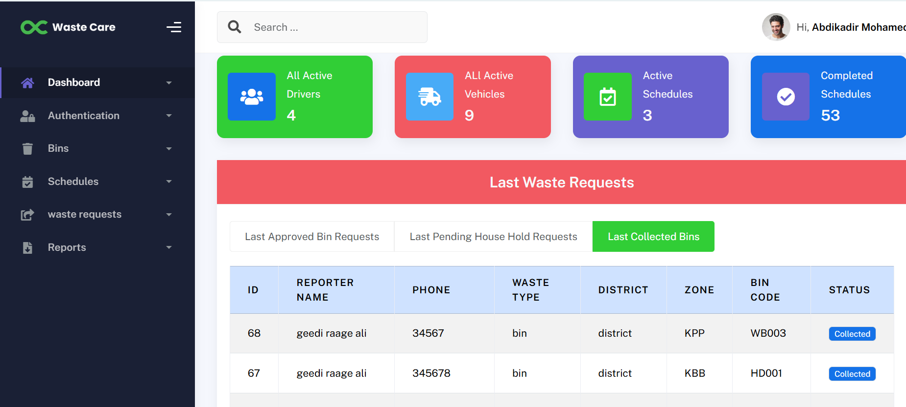
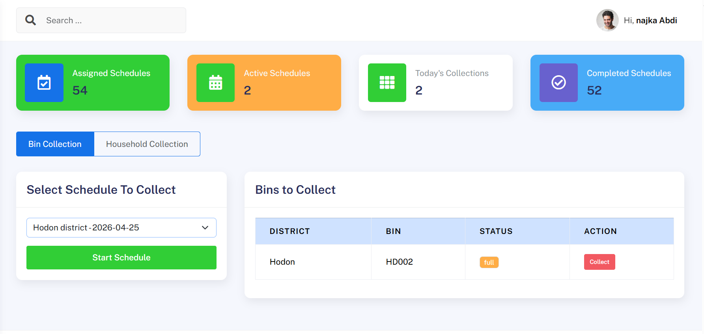

# Waste Collection Management System (WCMS)

A web-based **Waste Collection Management System** designed to help municipalities manage waste collection efficiently.
The system allows administrators to manage **drivers, vehicles, bins, schedules, and waste collection requests users**, while drivers can view and complete their assigned collections.

---

## 🚀 Features

### Admin Features

* Manage **Users and Roles**
* Manage **Collection Areas**
* Manage **Waste Bins**
* Manage **Vehicles**
* Create and assign **Collection Schedules**
* Handle **Bin Requests**
* Handle **Household Waste Requests**
* Generate **Reports**
* Monitor **Driver Activities**

### Driver Features

* View **Assigned Schedules**
* See **Today's Collections**
* View **Bins to Collect**
* Update **Collection Status**
* Track **Completed Collections**

---

## 🖥️ System Dashboard

The system provides dashboards for both:

* **Administrator Dashboard**



* **Driver Dashboard**




Admin dashboard shows system statistics such as:

* Total Drivers
* Total Vehicles
* Active Schedules
* Completed Collections & more

Driver dashboard shows:

* Assigned Schedules
* Active Collections
* Today's Tasks
* Completed Collections

---

## 🛠️ Technologies Used

Frontend:

* HTML5
* CSS3
* Bootstrap 5
* JavaScript
* jQuery

Backend:

* PHP

Database:

* MySQL

---

## 📂 Project Structure

```
WCMS/
│
├── assets/                 # CSS, images, fonts and frontend assets
│
├── backend/
│   ├── Api/                # API endpoints for AJAX requests(backend logic)
│   ├── config/             # Database connection and configuration
│   ├── includes/           # Reusable PHP components (header, sidebar, footer,etc.)
│   ├── javascript/         # Custom JavaScript files
│   └── views/              # System pages (index, login, users,driver, & all other pages)
├── database/               #database file(wcms.sql)
│
├── screenshot/             # System screenshots for README
│
├── index.php               # Front-end System entry point
│
└── README.md               # Project documentation
```

---

## Installation Guide

1. Clone the repository

```
https://github.com/Mahadshire/wcms.git
```

2. Move the project to your server directory

Example (XAMPP):

```
htdocs/wcms
```

3. Import the database

* Open **phpMyAdmin**
* Create a database called:

```
wcms
```

* Import the file:

```
database/wcms.sql
```

4. Run the project

Open in browser:

```
http://localhost/wcms       -> frontend
 or
http://localhost/wcms/backend/views    -> backend
```

---

## 🔐 Authentication

The system includes a role-based authentication system where:

* Admin manages the entire system
* Drivers only access their assigned schedules


| Role   | Access                           |
| ------ | -------------------------------- |
| Admin  | Full system management           |
| Driver | View schedules and collect waste |

---

## Demo Credentials

To quickly test the system, you can use the following accounts:

### Admin Account

* Email: **mahadyare122122@gmail.com**
* Password: **admin123**

Driver Account

* Email: **abzaict@gmail.com**
* Password: **driver123**

⚠️ Note: These credentials are for testing/demo purposes only. For production, make sure to create secure accounts and change passwords.


## 👨‍💻 Author

**Eng Shire**

---

## 📜 License

This project is for educational and demonstration purposes.
